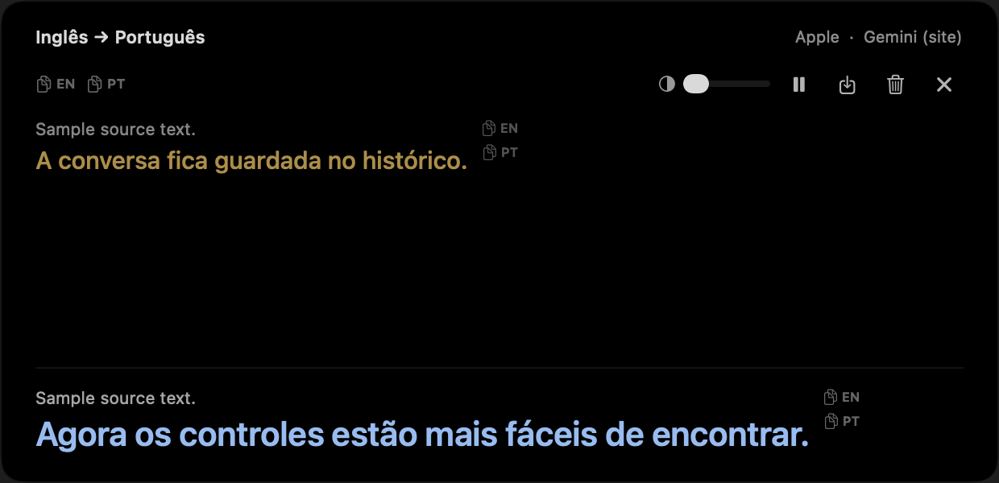
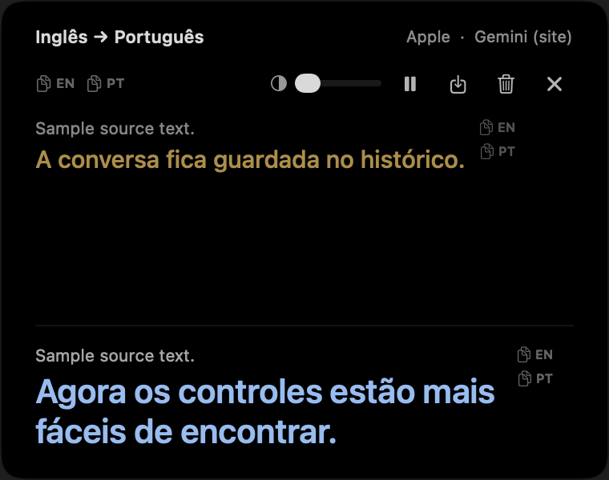
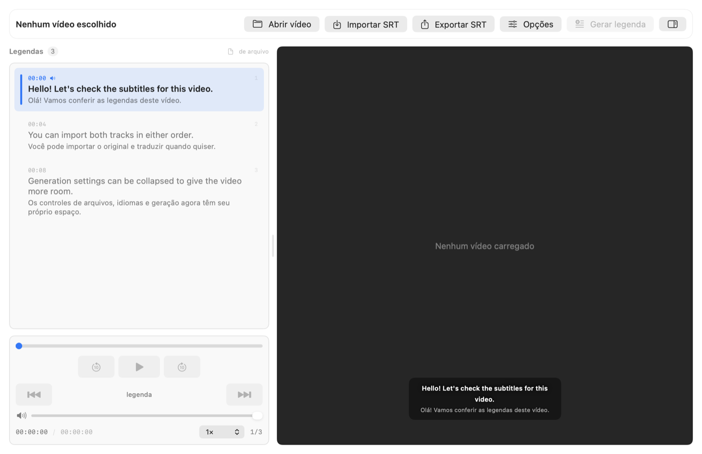
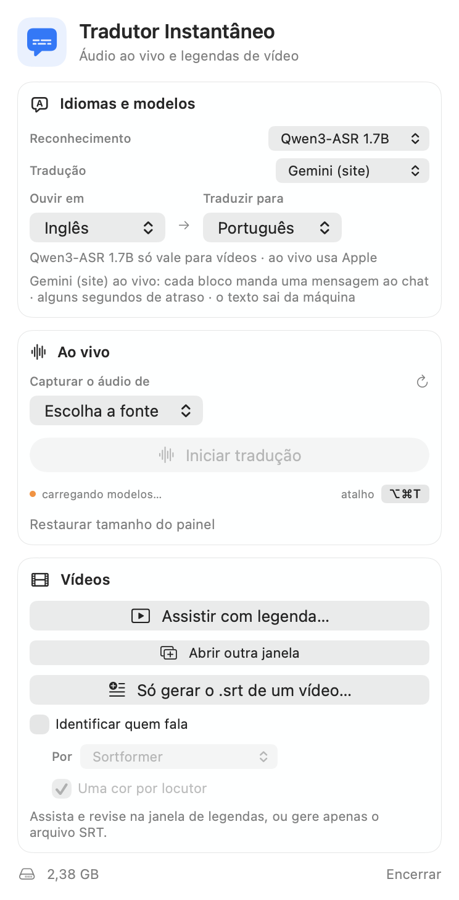

<div align="center">

# LingoSync

**Tradução e legendas em tempo real no macOS. Tudo local.**

Captura o áudio de qualquer aplicativo ou do microfone, transcreve e traduz
enquanto a pessoa fala — sem chave de API, sem conta, sem nuvem.




</div>

---

## Três coisas que ele faz

### Ouvir e traduzir ao vivo &nbsp;·&nbsp; <kbd>⌥</kbd><kbd>⌘</kbd><kbd>T</kbd>



Escolha de onde vem o som — um aplicativo, todo o áudio do sistema ou o
microfone — e o painel mostra três zonas:

- **vermelha**, o parcial cru do reconhecedor, que ainda oscila;
- **azul**, a fala que acabou de ser confirmada e traduzida;
- **amarela**, o histórico da sessão.

**O áudio nunca é cortado no meio da palavra.** O trecho é re-reconhecido
inteiro a cada 0,6 s e só sobe para a tela o prefixo em que duas passadas
concordam — cortar partia palavras, e nenhuma metade é reconhecível
("reported" virava "Reaper's" no fim de um bloco e "ported" no começo do
seguinte).

Pausar não solta a captura, os botões de copiar levam a sessão inteira, e a
exportação sai com hora e par de idiomas.

<br clear="right">

### Legendar um vídeo



Abre o vídeo, gera o `.srt` e deixa assistir com a legenda ao lado. Original e
tradução na mesma lista, navegação fala a fala, identificação de quem fala com
uma cor por locutor, importação e exportação de cada faixa em separado, e
retradução sem reconhecer de novo — o que custa segundos em vez de minutos.

### Controlar tudo de um lugar só



O app vive na barra de menus, sem ícone no Dock. Dali saem o par de idiomas, o
motor de reconhecimento, quem traduz, a fonte do áudio e as janelas de legenda.

Cada motor diz o que custa **antes** de ser escolhido: o painel avisa que o
DeepL leva 2 a 3 s por bloco ao vivo, que o Hunyuan residente ocupa 4,5 GB, e
que o Qwen só vale para vídeo. Escolha do usuário não se troca em silêncio.

<br clear="right">

---

## Como funciona

```
ao vivo
  áudio do app ──▶ Core Audio process tap (todos os processos do aplicativo)
     ou o mic  ──▶ AVCaptureSession na entrada escolhida
               ──▶ 16 kHz mono + VAD de dois limiares
               ──▶ trecho em andamento, re-reconhecido a cada 0,6 s
                     ├──▶ prefixo que ainda oscila ──▶ zona vermelha
                     └──▶ prefixo estável (2 passadas concordam)
                            └──▶ fecha na pontuação ──▶ tradução ──▶ azul e amarela

vídeo
  arquivo ──▶ faixa do idioma escolhido ──▶ áudio 16 kHz ──▶ nivela fala baixa
          ──▶ quem fala, quando pedido ──▶ reconhecimento com tempo
          ──▶ agrupa em frases ──▶ traduz em lotes
          ──▶ reparte em 2 linhas × 42 caracteres (20 se o destino é CJK)
          ──▶ .srt
```

## Começar

Command Line Tools bastam — **Xcode não é necessário**.

```bash
git clone git@github.com:almeidasrenato/LingoSync.git
cd LingoSync
swift build -c release
Scripts/bundle.sh TradutorApp "Tradutor" Resources/app-Info.plist release
open build/Tradutor.app
```

Requisitos: Apple Silicon, macOS 15 ou mais recente. O tradutor da Apple precisa
do macOS 26.

Na primeira vez o sistema pede **Gravação de Tela e Áudio do Sistema** (é assim
que se captura o áudio de outro aplicativo) e **Microfone**. Negada, a captura
não dá erro — entrega quadros zerados. Um binário aberto pelo terminal nunca
consegue essas permissões: só um `.app` assinado, aberto com `open`.

## Motores

Reconhecimento, escolhido no painel e limitado pelo idioma:

| Motor | Cobertura | Observação |
|---|---|---|
| **Apple** (padrão) | de, en, es, fr, it, ja, ko, pt, zh | `SpeechAnalyzer` do macOS 26 |
| **Parakeet TDT v3** | 10 idiomas europeus | ~120× tempo real, 469 MB |
| **Whisper turbo** | todos | mais lento, mais amplo, 1,2 GB |
| **Qwen3-ASR** 0.6B / 1.7B | 13 e 14 idiomas | fora do processo, **só em vídeo** |

Tradução: **Apple** (padrão, local), **DeepL**, **Google**, **Gemini**,
**Hunyuan-MT-7B** (local, fora do processo) e **Só transcrever**. Todos valem ao
vivo e em vídeo.

> [!NOTE]
> DeepL, Google e Gemini são dirigidos pela própria página ou por um endereço
> interno. **Uso automatizado contraria os termos desses sites**, e por isso são
> escolha consciente do usuário — nunca o padrão.

## Por que ele é assim

Quase toda decisão deste projeto tem um número atrás. Três exemplos:

**Japonês não tem espaço, e o confirmador contava palavras.** Em 75 s de
japonês a hipótese tinha 224 caracteres e **8 unidades**, a maior com três
frases inteiras — a zona azul só andava quando duas passadas repetiam um bloco
todo. Passando a unidade para o caractere onde a escrita é densa:

```
                  caracteres confirmados   frases entregues
ja-longo               51 → 153                 6 → 18
ja-musica              40 →  84                 3 →  8
en-conversa           393 → 393                16 → 16   (inglês intacto)
```

**Os três reconhecedores locais dizem a mesma coisa** — em 161 s de inglês,
320, 319 e 328 palavras. O que muda é o tempo: 1,8 s no Parakeet, 1,4 s na
Apple, 5,6 s no Whisper. Comparar motores contando trechos engana; compare por
texto.

**A Apple não está na disputa em japonês.** Em dois vídeos, 128 falas: o DeepL
acerta gênero em 6 de 8 casos contra 2 de 9 da Apple, e começa a frase com
maiúscula em 109 de 110 linhas contra 49. Não é elegância — é linha sem sentido
onde os outros acertam.

Mais de duas mil linhas desse tipo de registro estão no [CLAUDE.md](CLAUDE.md),
inclusive o que foi **testado e descartado**: Whisper large-v3, NLLB-200,
MADLAD-400, Nemotron, subtração espectral, filtro de graves, sobreposição de
contexto. Antes de trocar uma constante que tem comentário de medição, meça de
novo.

## Verificação

Não há `swift test`: as Command Line Tools não trazem `XCTest`. As verificações
vivem dentro dos binários, e **cada defeito consertado deixa um gate que falha
se ele voltar**.

```bash
./.build/release/tradutor-verify frases      # corte em frases, sobreposição
./.build/release/tradutor-verify motores     # limiares, retentativa do ANE
./.build/release/tradutor-verify captura     # lista de captura e de microfones
./.build/release/tradutor-verify srt <video> <orig> <dest> <motor> [--locutores]
```

Sem áudio no argumento, nenhum deles carrega modelo: rodam em milissegundos.

Captura, que precisa de `.app` assinado:

```bash
open "build/Tradutor Probe.app" --args isolamento  # a seleção é respeitada?
open "build/Tradutor Probe.app" --args duplo       # app e microfone juntos?
open "build/Tradutor Probe.app" --args variantes   # por que o microfone entrega zero?
```

E o app inteiro, de ponta a ponta:

```bash
open -n build/Tradutor.app --args --selftest-live en pt
open -n build/Tradutor.app --args --selftest-studio video.mp4 ja pt
open -n build/Tradutor.app --args --selftest-layout     # desenha as telas em PNG
```

## Privacidade

O áudio não sai da máquina com os motores locais — Apple, Parakeet, Whisper,
Qwen e Hunyuan rodam no seu Mac, e depois do primeiro download carregar não usa
rede. Os tradutores DeepL, Google e Gemini **mandam o texto para fora**, e é por
isso que não são o padrão e que o painel diz o custo de cada um antes da
escolha.

## Estrutura

```
Sources/
  AudioCapture/     tap, ring buffer, reamostragem, VAD   (sem dependências)
  TradutorCore/     reconhecimento, tradução, legendas
  TradutorApp/      painel flutuante, janela de legendas, barra de menus
  tradutor-probe/   verificação da captura
  tradutor-verify/  verificação do resto
Scripts/bundle.sh   monta o .app sem Xcode
```

`AudioCapture` não depende de nada externo de propósito: é a camada mais
arriscada e precisa compilar e rodar em segundos.

Os vídeos de exemplo e os gabaritos de quem-fala ficam fora do repositório —
são obra de terceiros. Os gates que dependem deles leem de `Videos Exemplo/` no
disco de quem mede.
