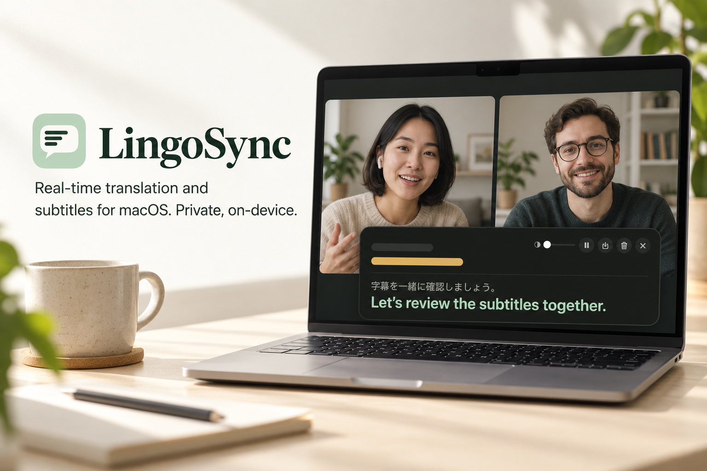
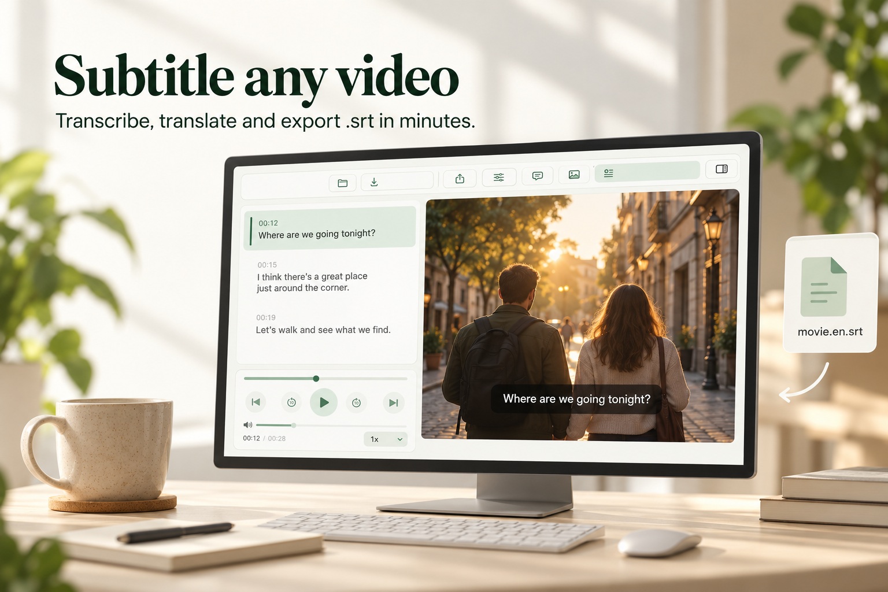
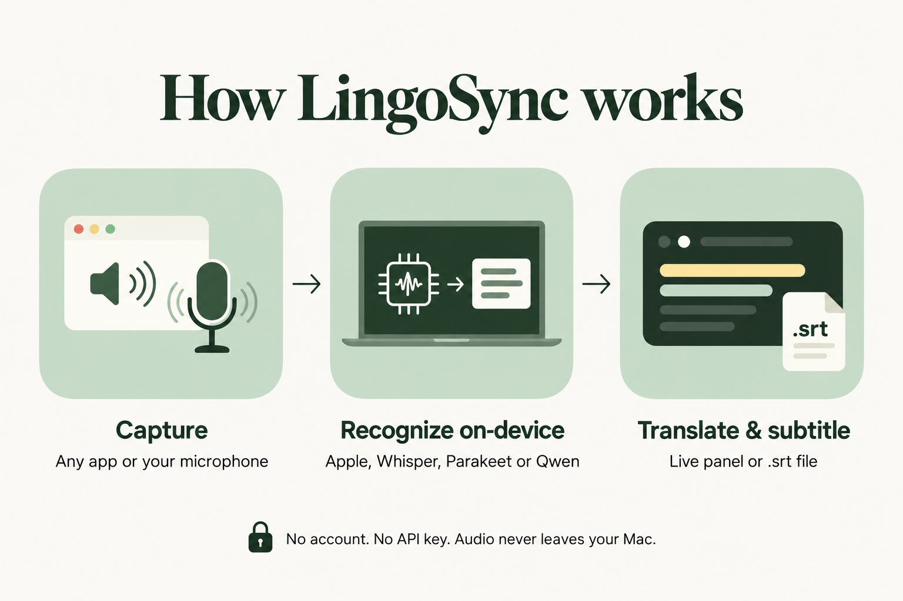

<div align="center">



# LingoSync

**Real-time translation and subtitles for macOS. Private, on-device.**

Captures the audio of any app or your microphone, transcribes it and translates
it while people speak — no API key, no account, no cloud.


[**Download the latest release**](https://github.com/almeidasrenato/LingoSync/releases/latest)

</div>

> [!NOTE]
> The interface is currently in **Portuguese**. Translation works between any of
> the supported languages (English, Japanese, Portuguese, Spanish, French,
> German, Italian, Chinese, Korean and more).

---

## What it does

### Listen and translate live &nbsp;·&nbsp; <kbd>⌥</kbd><kbd>⌘</kbd><kbd>T</kbd>


Pick where the sound comes from — one app, all system audio, or the
microphone — and a floating panel shows three zones:

- **coral**, the raw partial from the recognizer, still changing;
- **sage**, the sentence just confirmed and translated;
- **yellow**, the session history.

**Audio is never cut mid-word.** The running segment is re-recognized in full
every 0.6 s, and only the prefix that two passes agree on reaches the screen.
Cutting split words, and neither half was recognizable ("reported" became
"Reaper's" at the end of one chunk and "ported" at the start of the next).

Pausing keeps the capture alive, the copy buttons take the whole session, and
the export includes timestamps and the language pair.

<br clear="right">

### Subtitle any video



Open a video, generate the `.srt`, and watch it with the subtitles alongside.
Original and translation in the same list, cue-by-cue navigation, speaker
identification with one color per speaker, separate import and export of each
track, and re-translation without recognizing the audio again — seconds instead
of minutes. It can also **read subtitles already burned into the video** (OCR)
and translate them.


### Everything from the menu bar


The app lives in the menu bar, with no Dock icon. From there you choose the
language pair, the recognition engine, the translator, the audio source, and
open subtitle windows.

Every engine states its cost **before** you pick it: the panel warns that DeepL
takes 2–3 s per chunk live, that a resident Hunyuan uses 4.5 GB, and that Qwen
only works on video files. Your choice is never silently swapped.

<br clear="right">

---

## How it works



```
live
  app audio ──▶ Core Audio process tap (every process of the app)
   or mic   ──▶ AVCaptureSession on the chosen input
            ──▶ 16 kHz mono + two-threshold VAD
            ──▶ running segment, re-recognized every 0.6 s
                  ├──▶ prefix still changing ──▶ coral zone
                  └──▶ stable prefix (2 passes agree)
                         └──▶ closes on punctuation ──▶ translation ──▶ sage and yellow

video
  file ──▶ audio track in the chosen language ──▶ 16 kHz ──▶ level quiet speech
       ──▶ who speaks, when requested ──▶ timed recognition
       ──▶ group into sentences ──▶ translate in batches
       ──▶ split into 2 lines × 42 characters (20 for CJK targets)
       ──▶ .srt
```

## Install

1. Download **`LingoSync.dmg`** from the
   [latest release](https://github.com/almeidasrenato/LingoSync/releases/latest).
2. Open it and drag **LingoSync** into **Applications**.
3. The build is not notarized by Apple, so the first launch is blocked.
   **Right-click the app → Open → Open**, or go to
   **System Settings → Privacy & Security → Open Anyway**.
   If macOS says the app "is damaged", run once:
   ```bash
   xattr -dr com.apple.quarantine /Applications/LingoSync.app
   ```
4. Click the speech-bubble icon in the menu bar.

On first use macOS asks for **Screen & System Audio Recording** (that is how
another app's audio is captured) and **Microphone**. If denied, capture does not
fail loudly — it delivers silent frames — so grant both.

Requirements: Apple Silicon, macOS 15 or later. Apple's on-device translator
needs macOS 26. Models (Whisper, Parakeet, speaker identification) download
once on first use and then load without network.

## Build from source

Command Line Tools are enough — **Xcode is not required**.

```bash
git clone https://github.com/almeidasrenato/LingoSync.git
cd LingoSync
swift build -c release
Scripts/bundle.sh TradutorApp "Tradutor" Resources/app-Info.plist release
open build/Tradutor.app
```

`Scripts/release.sh <version>` builds the same app and packages it as
`LingoSync.dmg` and `LingoSync.zip` under `build/release/`.

## Engines

Recognition, chosen in the panel and limited by language:

| Engine | Coverage | Notes |
|---|---|---|
| **Apple** (default) | de, en, es, fr, it, ja, ko, pt, zh | macOS 26 `SpeechAnalyzer` |
| **Parakeet TDT v3** | 10 European languages | ~120× real time, 469 MB |
| **Whisper turbo** | all | slower, broader, 1.2 GB |
| **Qwen3-ASR** 0.6B / 1.7B | 13 and 14 languages | out of process, **video only** |

Translation: **Apple** (default, local), **DeepL**, **Google**, **Gemini**,
**Hunyuan-MT-7B** (local, out of process) and **Transcribe only**. All of them
work live and on video.

> [!NOTE]
> DeepL, Google and Gemini are driven through their own web pages or an
> internal endpoint. **Automated use goes against those sites' terms**, so they
> are a conscious user choice — never the default.

## Why it is built this way

Almost every decision in this project has a measurement behind it. Three
examples:

**Japanese has no spaces, and the confirmer counted words.** In 75 s of
Japanese the hypothesis had 224 characters and **8 units**, the largest with
three whole sentences — the confirmed zone only moved when two passes repeated
an entire block. Switching the unit to the character for dense scripts:

```
                  confirmed characters   sentences delivered
ja-long                 51 → 153                 6 → 18
ja-music                40 →  84                 3 →  8
en-conversation        393 → 393                16 → 16   (English untouched)
```

**The three local recognizers say the same thing** — in 161 s of English, 320,
319 and 328 words. What changes is time: 1.8 s on Parakeet, 1.4 s on Apple,
5.6 s on Whisper. Comparing engines by counting segments is misleading; compare
by text.

**Apple's translator is not in the race for Japanese.** Across two videos and
128 lines, DeepL gets gender right in 6 of 8 cases against 2 of 9 for Apple,
and starts sentences with a capital letter in 109 of 110 lines against 49. It
is not about elegance — it is lines that make no sense where the others get it
right.

More than two thousand lines of this kind of record live in
[CLAUDE.md](CLAUDE.md) (in Portuguese), including what was **tried and
dropped**: Whisper large-v3, NLLB-200, MADLAD-400, Nemotron, spectral
subtraction, low-cut filtering, context overlap. Before changing a constant
that carries a measurement comment, measure again.

## Verification

There is no `swift test`: the Command Line Tools ship without `XCTest`. Checks
live inside the binaries, and **every fixed bug leaves a gate that fails if it
comes back**.

```bash
./.build/release/tradutor-verify frases      # sentence splitting, overlap
./.build/release/tradutor-verify motores     # thresholds, ANE retry
./.build/release/tradutor-verify captura     # capture and microphone lists
./.build/release/tradutor-verify srt <video> <src> <dst> <engine> [--locutores]
```

Without an audio argument none of them loads a model: they run in milliseconds.

The whole app, end to end:

```bash
open -n build/Tradutor.app --args --selftest-live en pt
open -n build/Tradutor.app --args --selftest-studio video.mp4 ja pt
open -n build/Tradutor.app --args --selftest-layout     # renders the screens to PNG
```

## Privacy

With the local engines, audio never leaves your Mac — Apple, Parakeet, Whisper,
Qwen and Hunyuan run on-device, and after the first download loading uses no
network. The DeepL, Google and Gemini translators **send text out** (never
audio), which is why they are not the default and why the panel states the
cost of each before you pick it.

## Project structure

```
Sources/
  AudioCapture/     tap, ring buffer, resampling, VAD   (no dependencies)
  TradutorCore/     recognition, translation, subtitles
  TradutorApp/      floating panel, subtitle window, menu bar
  tradutor-probe/   capture checks
  tradutor-verify/  everything else
Scripts/bundle.sh   builds the .app without Xcode
Scripts/release.sh  packages a release (.dmg and .zip)
Scripts/icon.swift  draws the app icon
```

`AudioCapture` has no external dependencies on purpose: it is the riskiest
layer and needs to build and run in seconds.

Sample videos and speaker ground truth stay out of the repository — they are
third-party content.
