<div align="center">

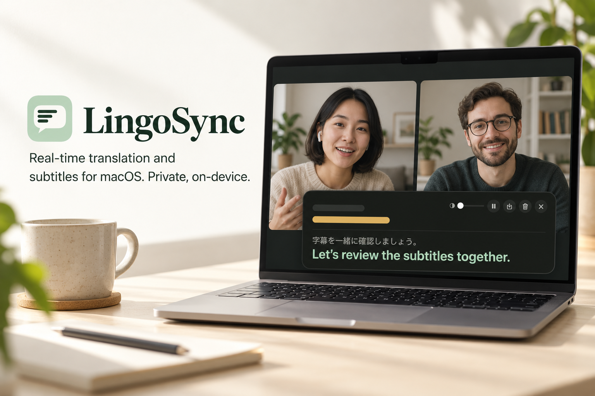

# LingoSync

**Understand any conversation on your Mac — live, subtitled, or as plain text.**

LingoSync listens to any app or your microphone, transcribes what is said and
translates it while people speak. It subtitles whole videos, and hands you the
clean text of any recording. All on-device: no API key, no account, no cloud.


### [⬇ Download LingoSync for macOS](https://github.com/almeidasrenato/LingoSync/releases/latest)

**Live translation** &nbsp;·&nbsp; **Read any recording** &nbsp;·&nbsp;
**Subtitles for any video** &nbsp;·&nbsp; **Private by design**

</div>

> [!NOTE]
> The interface is in **English** by default, with **Português** one click away
> in the menu footer. Translation works between any of the supported languages
> (English, Japanese, Portuguese, Spanish, French, German, Italian, Chinese,
> Korean and more).

---

## Made for

- **Calls and meetings in another language** — a floating panel translates the
  other side as they talk, over Zoom, Meet, Teams, a browser tab or any app.
- **Watching videos, anime and lectures** — generate subtitles for a file you
  already have, in your language, and watch them side by side.
- **Recordings you cannot play right now** — a voice memo on the train, a
  meeting you missed, an interview in another language: drop the file and
  read it, translated, in seconds.
- **Getting the words out of audio** — voice memos, interviews, podcasts,
  dictation: one click gives you clean, copyable text.

## Listen and translate live &nbsp;·&nbsp; <kbd>⌥</kbd><kbd>⌘</kbd><kbd>T</kbd>

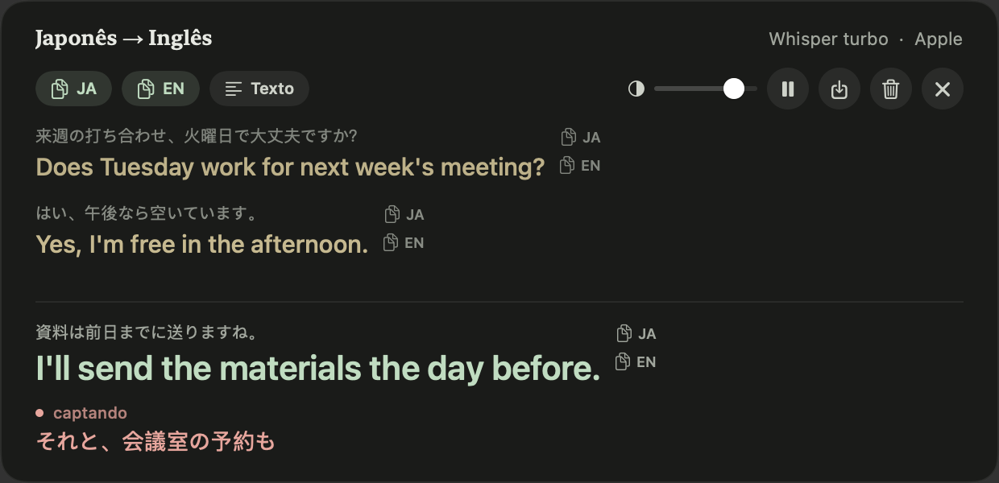

Pick where the sound comes from — one app, all system audio, or the
microphone — and a floating panel keeps up with the conversation:

- **coral**, what is being heard right now, still settling;
- **sage**, the sentence just confirmed and translated;
- **yellow**, everything said so far, original above the translation.

It floats over full-screen video, follows you across desktops and never steals
focus. Drag it by the header, fade its background until the video shows
through — the text stays sharp — and copy the whole session in either language
with one click.

**Audio is never cut mid-word.** The running segment is re-recognized in full
every 0.6 s, and only the prefix that two passes agree on reaches the screen.
Cutting split words, and neither half was recognizable ("reported" became
"Reaper's" at the end of one chunk and "ported" at the start of the next).

## Read a recording without playing it

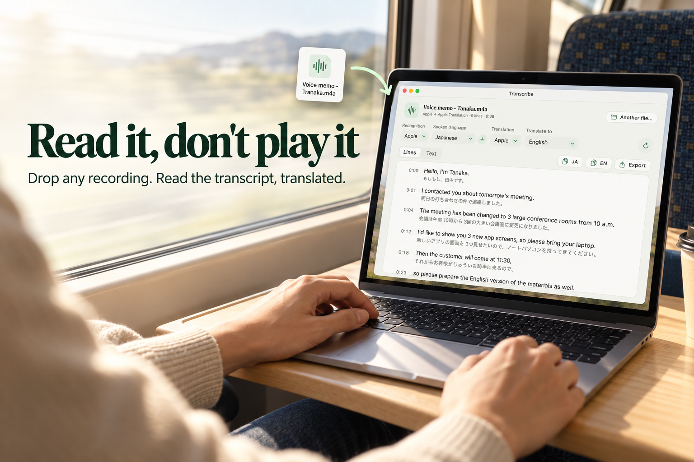

Someone sent you a two-minute voice memo and you are in a meeting, on a train,
or it is simply in a language you do not speak. Open **Transcribe on screen…**
from the menu, drop the file on the window, and read it.

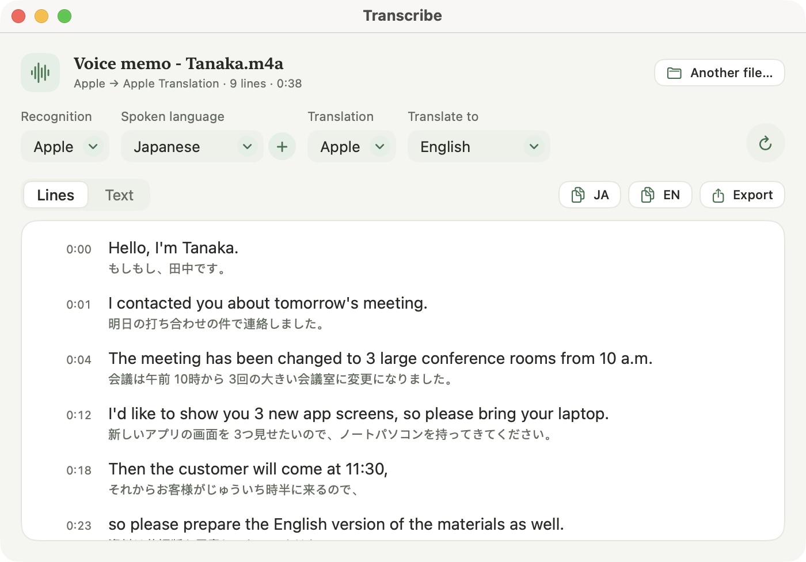

- **Any audio or video** — `.m4a` voice memos, `.mp3`, `.wav`, recorded calls,
  `.mp4`, `.mov`. Drag it in or press <kbd>⌘</kbd><kbd>O</kbd>.
- **Speech first, translation right after** — the recognized words show up
  as soon as they exist, and each translated batch takes their place, the same
  way the live panel fills in.
- **Lines or text** — every line with its timestamp and the original
  underneath to check against, or one clean paragraph to read top to bottom.

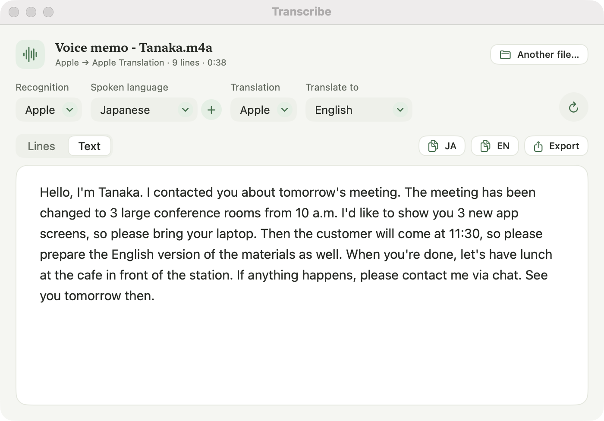

- **Copy in either language** with one click (`JA`, `EN`…), or export `.txt`
  or `.srt`. **Nothing is written to disk until you export** — reading a
  recording leaves no files behind.
- Change the engine or the language right in the window and press ↻ to run it
  again. Closing the window cancels the work.

Apple's on-device recognizer gets through a five-minute recording in about
three seconds, and with a local translator nothing leaves your Mac.

## Just the words

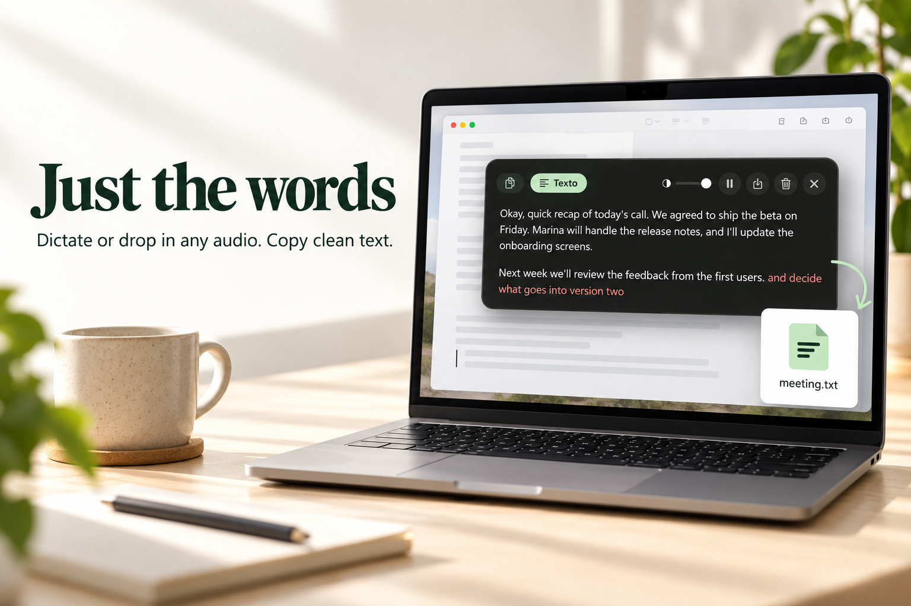

Sometimes you do not want subtitles — you want the text. Flip the panel to
**Text** and it becomes one running, selectable transcript: talk, then paste
it into your notes, an email or a chat.

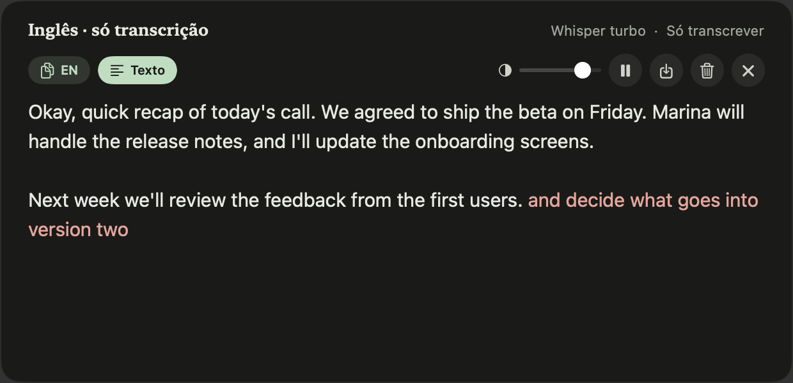

To save a recording straight to a file, **Just extract the text (.txt)** in
the menu turns any video or audio file into plain running text — no timecodes, filler words like "um" and "uh"
removed, paragraphs where the speaker paused. Pick a translator and you get
the translated text instead.

## Subtitle any video

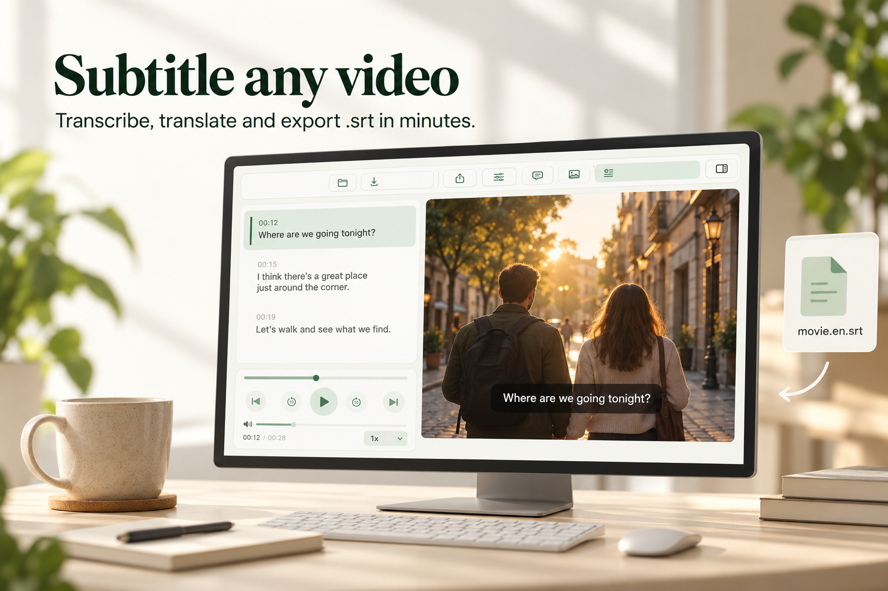

Open a video and press **Generate**. LingoSync transcribes, translates and
lines up every subtitle — 2 lines × 42 characters, 20 for Japanese and
Chinese — and plays the video with the list alongside.

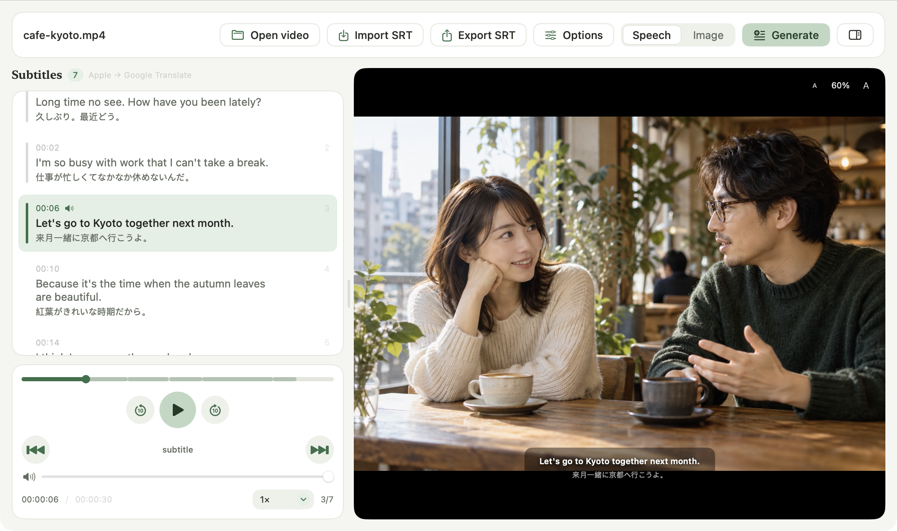

- original and translation in the same list, with ← → to jump cue by cue;
- **who is speaking**, with one color per speaker;
- **re-translate** with another engine in seconds, without recognizing the
  audio again;
- import and export each track separately, as `.srt` or plain `.txt`;
- **reads subtitles already burned into the video** (OCR) and translates them.

## Everything from the menu bar

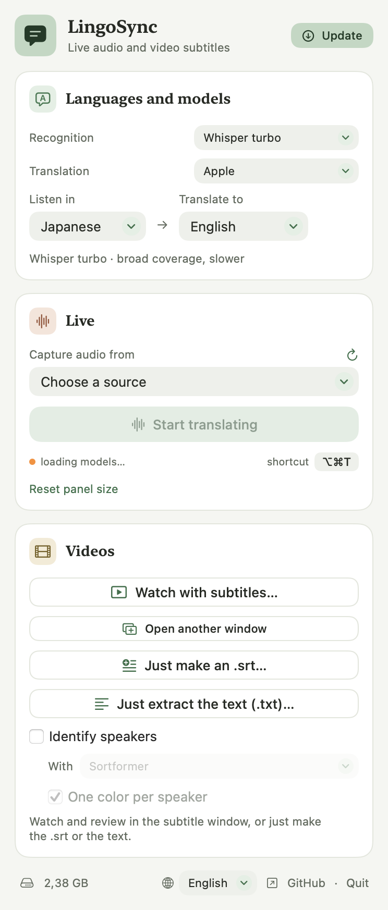

The app lives in the menu bar, with no Dock icon. From there you choose the
language pair, the recognition engine, the translator and the audio source,
and open subtitle and transcription windows.

Every engine states its cost **before** you pick it: the panel warns that DeepL
takes 2–3 s per chunk live, that a resident Hunyuan uses 4.5 GB, and that Qwen
only works on video files. Your choice is never silently swapped.

The app speaks **English or Portuguese** — switch in the footer and every
window follows at once, no restart. When a new version is out, an **Update**
button appears at the top. It
downloads the `.dmg` and opens it — the app never replaces itself, which would
drop its screen-recording permission. The GitHub link lives in the footer.

<br clear="right">

## Let your AI assistant listen

Claude and other coding agents cannot hear audio. LingoSync ships a
[Claude Code](https://claude.com/claude-code) skill that transcribes any audio
or video file locally, so you can say *"summarize this recording"* and it just
works.

```bash
swift build -c release --product tradutor-verify
ln -s "$PWD/integrations/claude-code/lingosync-transcrever-audio" ~/.claude/skills/
```

Under the hood it is one command, handy in any script:

```bash
integrations/claude-code/lingosync-transcrever-audio/scripts/lingosync-transcrever meeting.m4a en
```

It prints the running text to stdout (Whisper by default, any language), and
nothing leaves your Mac.

---

## How it works

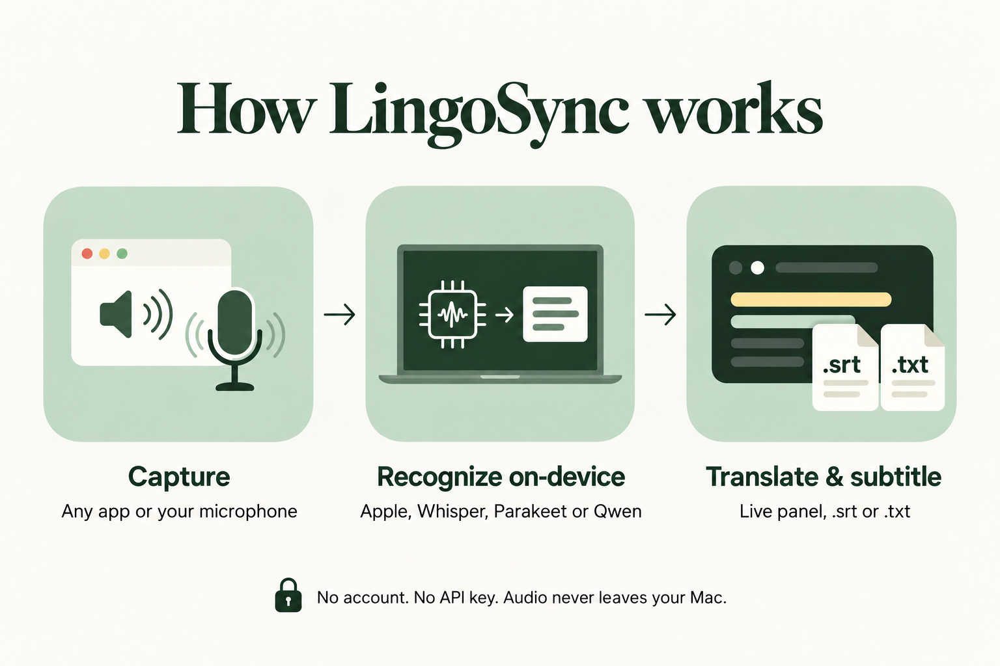

```
live
  app audio ──▶ Core Audio process tap (every process of the app)
   or mic   ──▶ AVCaptureSession on the chosen input
            ──▶ 16 kHz mono + two-threshold VAD
            ──▶ running segment, re-recognized every 0.6 s
                  ├──▶ prefix still changing ──▶ coral zone
                  └──▶ stable prefix (2 passes agree)
                         └──▶ closes on punctuation ──▶ translation ──▶ sage and yellow

video
  file ──▶ audio track in the chosen language ──▶ 16 kHz ──▶ level quiet speech
       ──▶ who speaks, when requested ──▶ timed recognition
       ──▶ group into sentences ──▶ translate in batches
       ──▶ split into 2 lines × 42 characters (20 for CJK targets)
       ──▶ .srt, or running text ──▶ .txt
```

## Install

1. Download **`LingoSync.dmg`** from the
   [latest release](https://github.com/almeidasrenato/LingoSync/releases/latest).
2. Open it and drag **LingoSync** into **Applications**.
3. The build is not notarized by Apple, so the first launch is blocked.
   **Right-click the app → Open → Open**, or go to
   **System Settings → Privacy & Security → Open Anyway**.
   If macOS says the app "is damaged", run once:
   ```bash
   xattr -dr com.apple.quarantine /Applications/LingoSync.app
   ```
4. Click the speech-bubble icon in the menu bar.

On first use macOS asks for **Screen & System Audio Recording** (that is how
another app's audio is captured) and **Microphone**. If denied, capture does not
fail loudly — it delivers silent frames — so grant both.

Requirements: Apple Silicon, macOS 15 or later. Apple's on-device translator
needs macOS 26. Models (Whisper, Parakeet, speaker identification) download
once on first use and then load without network.

## Build from source

Command Line Tools are enough — **Xcode is not required**.

```bash
git clone https://github.com/almeidasrenato/LingoSync.git
cd LingoSync
swift build -c release
Scripts/bundle.sh TradutorApp "Tradutor" Resources/app-Info.plist release
open build/Tradutor.app
```

`Scripts/release.sh <version>` builds the same app and packages it as
`LingoSync.dmg` and `LingoSync.zip` under `build/release/`.

## Engines

Recognition, chosen in the panel and limited by language:

| Engine | Coverage | Notes |
|---|---|---|
| **Apple** (default) | de, en, es, fr, it, ja, ko, pt, zh | macOS 26 `SpeechAnalyzer` |
| **Parakeet TDT v3** | 10 European languages | ~120× real time, 469 MB |
| **Whisper turbo** | all | slower, broader, 1.2 GB |
| **Qwen3-ASR** 0.6B / 1.7B | 13 and 14 languages | out of process, **video only** |

Translation: **Apple** (default, local), **DeepL**, **Google**, **Gemini**,
**Hunyuan-MT-7B** (local, out of process) and **Transcribe only**. All of them
work live and on video.

> [!NOTE]
> DeepL, Google and Gemini are driven through their own web pages or an
> internal endpoint. **Automated use goes against those sites' terms**, so they
> are a conscious user choice — never the default.

## Why it is built this way

Almost every decision in this project has a measurement behind it. Four
examples:

**Japanese has no spaces, and the confirmer counted words.** In 75 s of
Japanese the hypothesis had 224 characters and **8 units**, the largest with
three whole sentences — the confirmed zone only moved when two passes repeated
an entire block. Switching the unit to the character for dense scripts:

```
                  confirmed characters   sentences delivered
ja-long                 51 → 153                 6 → 18
ja-music                40 →  84                 3 →  8
en-conversation        393 → 393                16 → 16   (English untouched)
```

**The three local recognizers say the same thing** — in 161 s of English, 320,
319 and 328 words. What changes is time: 1.8 s on Parakeet, 1.4 s on Apple,
5.6 s on Whisper. Comparing engines by counting segments is misleading; compare
by text.

**Apple's translator is not in the race for Japanese.** Across two videos and
128 lines, DeepL gets gender right in 6 of 8 cases against 2 of 9 for Apple,
and starts sentences with a capital letter in 109 of 110 lines against 49. It
is not about elegance — it is lines that make no sense where the others get it
right.

**Singers do not punctuate, and neither do recognizers.** On a 5½-minute
song in Portuguese, Apple's recognizer left **2 punctuation marks** in the
whole transcript — yet it started every sung line with a capital letter. When
a segment ends with no punctuation, the next one starts with a capital, and
there is a measured pause of 0.8 s or more between them, LingoSync closes the
sentence. The same rule helps every engine and every cased language, and in
ordinary speech it fires at most once per video, always at a real sentence end:

```
                 punctuation marks    word error vs. the published lyrics
Apple                 2 → 25                 0.353 → 0.353
Whisper               6 → 33                 0.451 → 0.440
```

Isolating the voice first with macOS's own `AUSoundIsolation` was measured
too, and made recognition **worse** on four of five engines.

More than two thousand lines of this kind of record live in
[CLAUDE.md](CLAUDE.md) (in Portuguese), including what was **tried and
dropped**: Whisper large-v3, NLLB-200, MADLAD-400, Nemotron, spectral
subtraction, low-cut filtering, context overlap. Before changing a constant
that carries a measurement comment, measure again.

## Verification

There is no `swift test`: the Command Line Tools ship without `XCTest`. Checks
live inside the binaries, and **every fixed bug leaves a gate that fails if it
comes back**.

```bash
./.build/release/tradutor-verify frases      # sentence splitting, overlap
./.build/release/tradutor-verify motores     # thresholds, ANE retry
./.build/release/tradutor-verify captura     # capture and microphone lists
./.build/release/tradutor-verify srt <video> <src> <dst> <engine> [--locutores]
```

Without an audio argument none of them loads a model: they run in milliseconds.

The whole app, end to end:

```bash
open -n build/Tradutor.app --args --selftest-live en pt
open -n build/Tradutor.app --args --selftest-studio video.mp4 ja pt
open -n build/Tradutor.app --args --selftest-layout     # renders the screens to PNG
```

## Privacy

With the local engines, audio never leaves your Mac — Apple, Parakeet, Whisper,
Qwen and Hunyuan run on-device, and after the first download loading uses no
network. The DeepL, Google and Gemini translators **send text out** (never
audio), which is why they are not the default and why the panel states the
cost of each before you pick it.

The only request the app makes on its own is a public check of the latest
GitHub release when you open the menu (at most every 6 hours) — no account,
no identifier, nothing about your Mac.

## Project structure

```
Sources/
  AudioCapture/     tap, ring buffer, resampling, VAD   (no dependencies)
  TradutorCore/     recognition, translation, subtitles
  TradutorApp/      floating panel, subtitle window, menu bar
  tradutor-probe/   capture checks
  tradutor-verify/  everything else
Scripts/bundle.sh   builds the .app without Xcode
Scripts/release.sh  packages a release (.dmg and .zip)
Scripts/icon.swift  draws the app icon
```

`AudioCapture` has no external dependencies on purpose: it is the riskiest
layer and needs to build and run in seconds.

Sample videos and speaker ground truth stay out of the repository — they are
third-party content.
